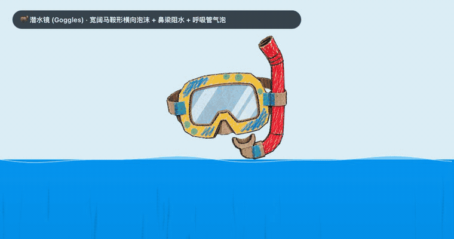
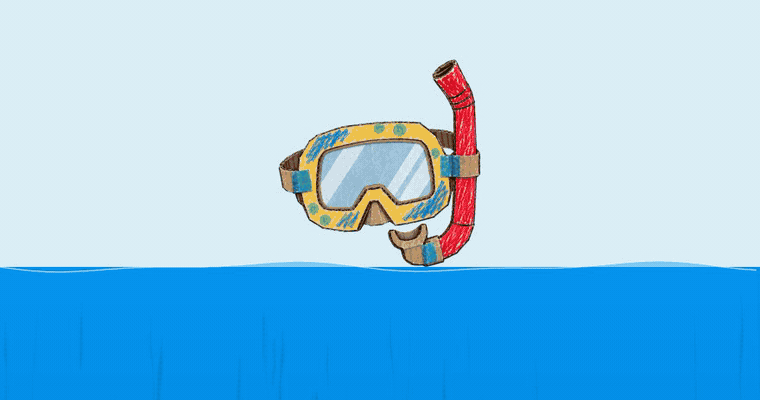
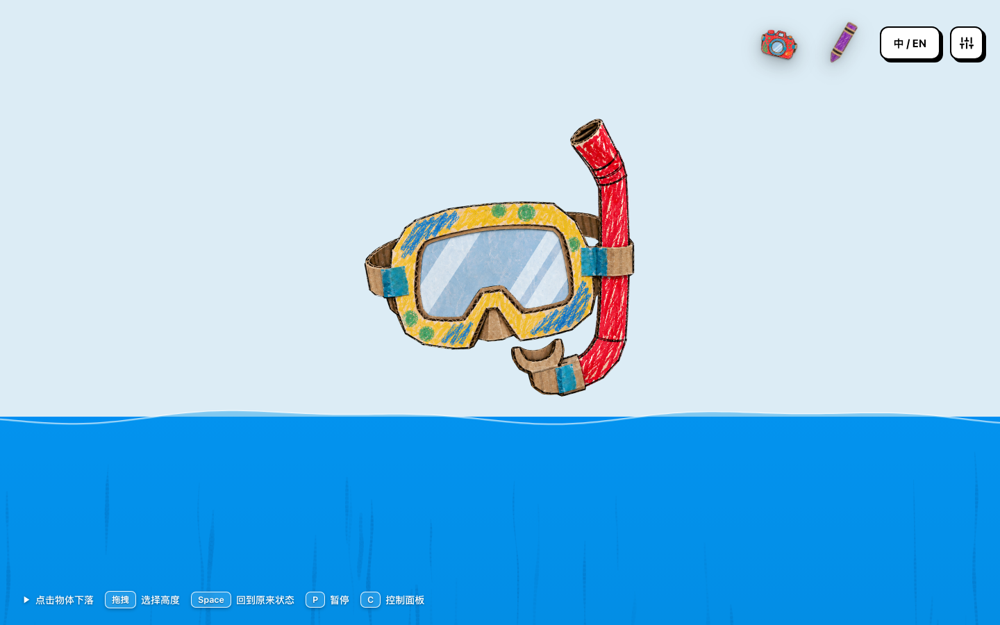
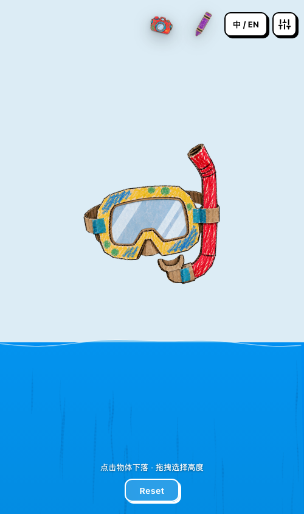

# Wax and Water

### Into the Crayon Sea — turning what we observed in crayon picture books into procedural underwater motion on the web
*Vanilla JavaScript + Canvas 2D · Zero Runtime Dependencies · Runtime-Generated Water Effects*

[](https://wfdiao.github.io/wax-and-water/)
[](#-see-it-in-motion)
[](LICENSE)

English | [简体中文](README.zh-CN.md)

**Wax and Water is an interactive 2D web experiment:** drop a dive mask into a crayon sea and watch the splash, surface froth, and bubble wake emerge in real time—all with the textured, uneven look of crayon on paper.

---

## 🌊 See It in Motion

<p align="center">
  
  <br>
  <em>One shared engine, three tuned object profiles: geometry-aware shedding, dynamic drag, and distinct bubble wakes.</em>
  <br><br>
  <a href="https://youtu.be/GfNf6GMqlhY">Watch the full demo on YouTube →</a>
</p>

---

## 👁️ The Missing Variable Was Observation

> *"We don't draw water; we draw the changes it leaves behind — bubbles, surface froth, and shedding wakes become the visual language of the sea."*

This project did not begin with a fluid solver. It began with a stubborn visual gap: a dive could be physically plausible and still not feel alive.

The breakthrough came from slowing down with a children's picture book. Its chalky discs, broken rings, and bead-like trails were not merely decorative style. They were compressed observations of water—selected marks that allow the viewer's own bodily memory to complete the motion.

**Wax and Water does not try to solve water. It models the cues by which we recognize it.** The system uses visually motivated heuristics grounded in simplified physics: bubbles rise, wakes preserve motion history, carried air dissipates, and paper grain remains fixed while pigment moves across it. None of these rules is a complete fluid model. Together, they are enough to make crayon marks behave convincingly like water.

---

## ⚡ What This Experiment Explores

Some web water effects use 3D simulation, shaders, or pre-rendered sprite sequences. **Wax and Water** explores a smaller 2D path: visually motivated heuristics grounded in simplified physics, with motion, geometry, and particle density driving a picture-book illustration language in real time.

1. **Runtime-generated effects**: Surface froth, turbulent wakes, and bubble trails are computed during interaction rather than played back as pre-baked animation loops. The GIF previews in this repository are recordings of that live system.
2. **Impact-conditioned response**: Entry speed initializes a shared impact scale that changes the carried-air budget, surface-froth width, underwater cloud depth, and splash intensity. A finite carried-air budget then gates a release rate that decays exponentially over time.
3. **The wake stores motion history**: Trail marks are emitted from earlier positions, inherit part of the object's velocity, and then drift toward their own buoyant rise. The visible wake therefore combines the object's path with the age of each mark.
4. **Density-driven morphology**: Local bubble density influences whether a mark reads as an opaque chalk cluster or a loose, hand-drawn crayon ring.
5. **Geometry-aware shedding**: Bubble emission is sampled along each object's outer contour and weighted by surface normals and its current direction of motion.
6. **Texture belongs to paper space**: Crayon grain remains anchored to the stationary display surface instead of sliding with moving particles like a sticker.

This is an art-directed creative-coding experiment, not a computational fluid dynamics solver. Its equations are chosen for readable motion and illustration rhythm rather than physical prediction.

---

## 🤿 Three Objects, One Shared Engine

All three objects use the same simulation and rendering pipeline. Each also has a tuned physical profile — including terminal speed, buoyancy, carried air, and froth scale — so the comparison is not produced by silhouette alone.

* 🤿 **Dive Mask (Broad & Buoyant)**: High frontal resistance, wide surface froth, contour-weighted bead chains, and a finite secondary glugging source from the snorkel.
* 📷 **Underwater Camera (Boxy & Heavy)**: Faster descent, a compact entry cavity, and symmetrical shedding around exposed box edges and corners.
* ✏️ **Wax Crayon (Needle-like Dart)**: Minimal surface splash and a slender wake that follows its low-resistance vertical entry.

---

## 💡 Core Heuristics

Instead of solving the Navier–Stokes equations, the experiment uses visually motivated heuristics that evoke the tactile memory of children's picture books:

| Core Idea | Mechanism | Visual & Technical Purpose |
| :--- | :--- | :--- |
| **Impact-Conditioned Response & Air Decay** | Entry speed sets a shared impact scale; trailing-air release decays as $r(t) = r_0 e^{-t/\tau}$ | One contact event initializes related froth, cloud, splash, and carried-air effects. The finite air supply gates an increasingly sparse bubble trail rather than switching between pre-baked animation clips. |
| **Geometry-Aware Shedding** | $w = \max(0, \mathbf{n} \cdot (-\hat{\mathbf{v}}))^{1.5} + 0.35(1-|\mathbf{n}\cdot\hat{\mathbf{v}}|)$ | Favors trailing edges and exposed corners using the contour normal $\mathbf{n}$ and unit velocity $\hat{\mathbf{v}}$. |
| **Density-Driven Morphology** | Local proximity test plus particle-size overlap | Dense neighborhoods move toward solid chalk clusters; lower-density neighborhoods move toward open crayon rings. |
| **Paper-Space Texture** | Offscreen layers composited through `destination-in` | Anchors paper tooth to display coordinates while pigments and particles move across it. |
| **Art-Directed Motion** | Gravity, buoyancy, linear and quadratic drag, followed by a timed settle | Produces a readable plunge and a gentle final hover without claiming physically exact equilibrium. |
| **Shareable Playground** | URL query parameters such as `?obj=...&terminal=...` | Reproduces selected object, language, timing, and tuning parameters. |

---

## 🔬 Technical Deep Dive

<p align="center">
  
  <br>
  <em>Poised hover → impact froth → trailing bead wake → art-directed settling.</em>
</p>

### 1. Normal-Weighted Contour Emission

Fixed emission points break down when an object rotates or tilts. When browser security permits pixel access, the engine samples 96 boundary coordinates from the asset's alpha channel and derives their outward normals. A precomputed contour is used as a `file://` fallback. The emission weight for a boundary point is:

$$w = \max(0, \mathbf{n} \cdot (-\hat{\mathbf{v}}))^{1.5} + 0.35(1 - |\mathbf{n} \cdot \hat{\mathbf{v}}|)$$

where $\hat{\mathbf{v}} = \mathbf{v} / \|\mathbf{v}\|$ is the normalized velocity. Emission therefore shifts toward the side that is currently trailing as the object turns and wobbles.

### 2. Adaptive Bubble Morphology

In picture-book illustration, dense foam can read as soft, opaque chalk, while sparse rising bubbles read as loose circular strokes. Each bubble measures nearby particles using a 40px broad-phase window followed by a size-aware overlap test. Three or more neighbors pull its morphology toward a solid disc; lower-density surroundings pull it toward an open ring. Temporal smoothing prevents abrupt visual flicker near the threshold.

### 3. Decoupling Paper Grain from Particle Movement

A common flaw in digital crayon brushes is stamping textured noise onto a shape and moving both together. Here, froth, bubbles, and wakes are first drawn as solid shapes on offscreen Canvas layers, then masked with a stationary grain pattern using `destination-in`. Pigment moves; the paper stays still.

### 4. Structured Imperfection Without Frame-to-Frame Noise

The handmade character does not come from redrawing every mark with unrelated randomness. Ripple rings are split into incomplete arcs; bubble contours use seeded wobble and deliberate gaps; stroke widths taper and vary; and density-driven morphology is smoothed over time. Because these irregularities are seeded or temporally continuous, the marks remain imperfect without flickering or losing coherent motion.

---

## 🕹️ Interactive Playground

<p align="center">
  
  
</p>

### Quick Controls

* **Click / Tap Object**: Release it into a freefall plunge.
* **Drag & Drop**: Adjust release altitude to compare different entry speeds.
* **Space**: Reset to the poised position.
* **P**: Pause or resume the simulation.
* **C**: Toggle the nine-section live tuning panel.
* **Sticker Switcher**: Switch among the Dive Mask 🤿, Camera 📷, and Crayon ✏️.

### Reproducible URL Parameters

The playground accepts URL parameters for the object, language, time, and individual tuning values. Its “copy link” action preserves a curated subset of the most useful controls:

* `?obj=crayon&terminal=480&spreadRate=160` — high-speed crayon entry
* `?obj=camera&lang=en` — camera profile in English
* `?obj=mask&t=1.0` — jump to one second after water contact

---

## 🧭 How It Evolved

1. **Separate stroke shape from paper grain.** Three early real-time drawing approaches were compared. The useful result was not a prettier brush preset, but an architectural rule: the brush tip defines shape; a stationary paper-space mask defines texture.
2. **Observe before simulating.** A close reading of Jacqueline Davies and Sonia Sánchez's *Bubbles... Up!* produced a small visual vocabulary: dense chalk foam, open bubble rings, bead-like wakes, and environmental marks that carry the sense of motion.
3. **Replace an arbitrary emission rule.** The first dive-mask version released bubbles from predetermined points beneath the lenses. Visual review revealed that this was both arbitrary and physically backwards, leading to the contour-normal weighting used now.
4. **Generalize the experiment.** The original single-object spike became a public playground with three silhouettes, tuned object profiles, bilingual controls, responsive layouts, and reproducible share links.

The development process was iterative and judgment-led: failed visual hypotheses, parameter bugs, and comparison frames were treated as evidence rather than hidden behind the final polish.

---

## 📖 Creative Context & Origins

* **The *Finding Nemo* memory**: The falling dive mask began with a childhood memory of an ordinary human object sinking into a vast blue space. Instead of recreating a cinematic 3D look, the experiment moved toward cardboard cutouts, wax crayons, and picture-book physics.
* **The *Bubbles... Up!* observation study**: Reading the book with my daughter prompted us to slow down and notice how white scumbles, foam clusters, and crayon rings can make still paper feel full of underwater motion.
* **AI-assisted exploration**: General-purpose AI tools supported coding and helped translate visual observations into testable rules. The process remained observation- and judgment-led: each result was inspected, corrected, and refined against the intended motion.

A longer design and parenting essay is in progress.

---

## 🛠️ Run Locally

The interactive demo has no build step and no runtime package installation. Clone the repository, then open `index.html` in a modern browser:

```bash
git clone https://github.com/wfdiao/wax-and-water.git
cd wax-and-water
```

Opening the file directly uses bundled fallback contours. If you already have Node.js and prefer a local server, you can optionally run:

```bash
npx serve .
```

---

## 📜 Authors & License

* **Wanfang Diao** ([@wfdiao](https://github.com/wfdiao)) and her daughter — family-project concept and visual observation.
* Wanfang led the interaction design and implementation with AI-assisted creative coding.
* The object illustrations were AI-generated and art-directed for this project.
* Created in the *Flying Fish (飞飞鱼)* family co-creation lab.
* Source code is released under the [MIT License](LICENSE). Visual and media assets are not covered unless explicitly noted.
